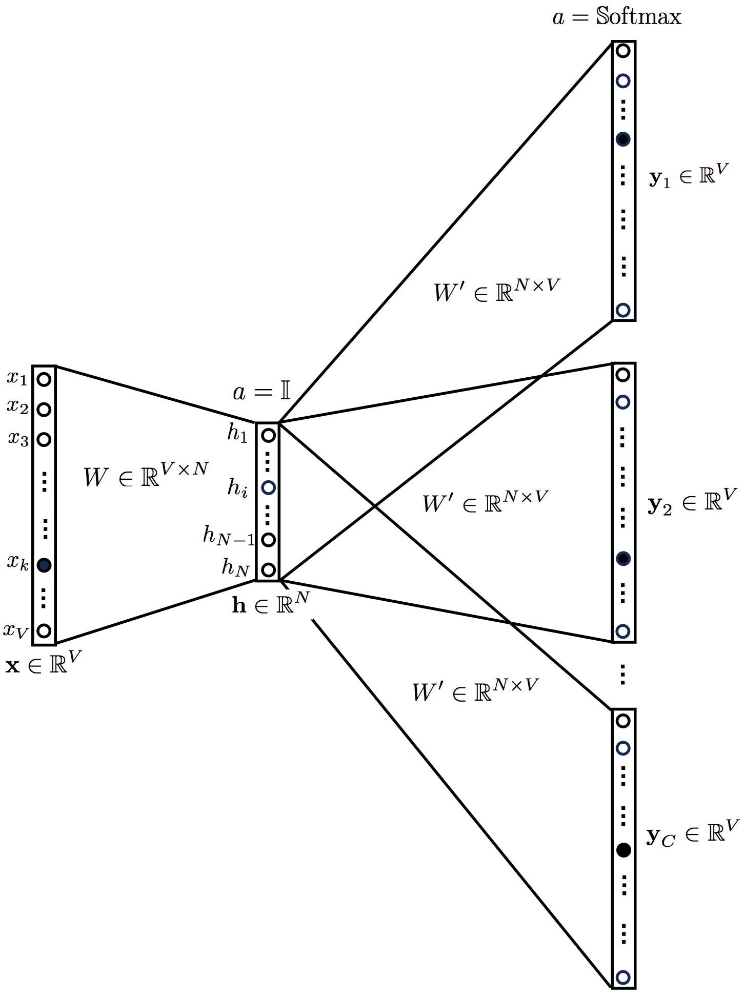

# COMP 550 Repository 
- This repository will contain all the different csripts, data, outputs, files, links to literature and anything else that we will be using in the final project. 

## Skip-gram word2vec model: 

