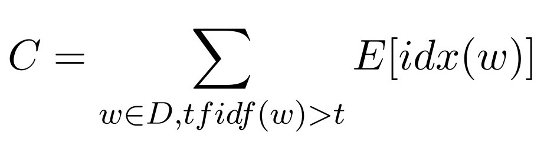
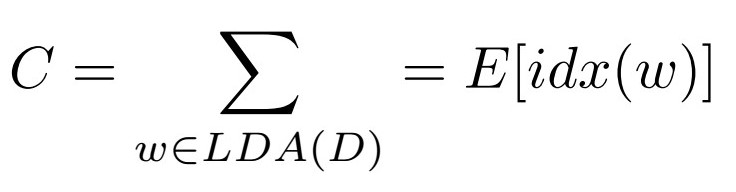
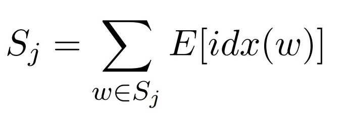
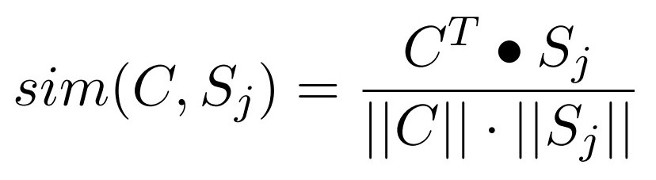
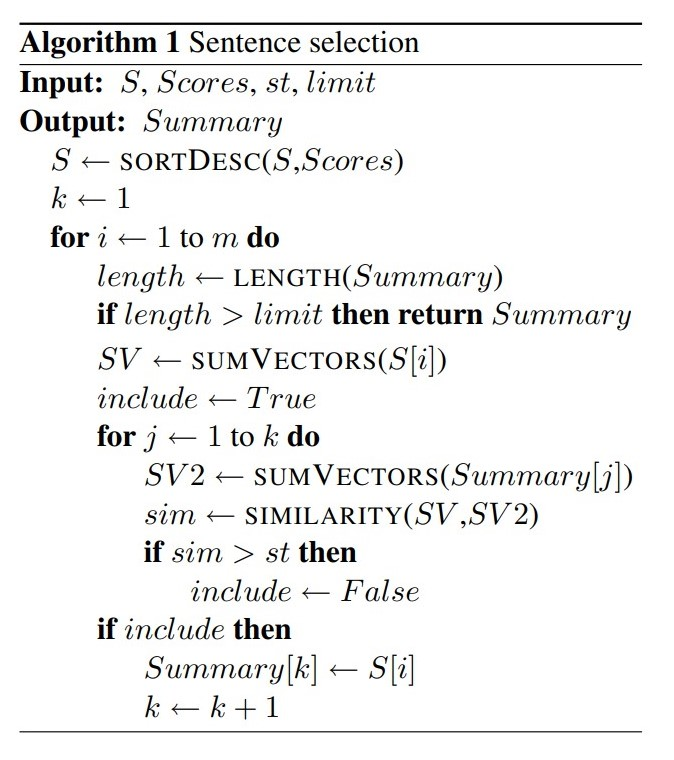
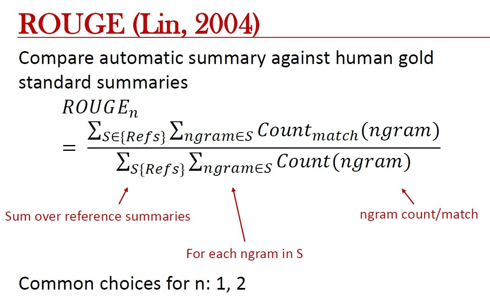

# Improving Centroid-Based Text Summarization through LDA-based Document Centroids 

## Our paper: 
- https://drive.google.com/file/d/1plsPxIYHsWAtW50tYm7YJvOgpuveqFqn/view?usp=sharing

## This work is based on: 
- **Centroid-based Text Summarization through Compositionality of Word Embeddings** https://www.aclweb.org/anthology/W17-1003.pdf 
- **Repo:** https://github.com/gaetangate/text-summarizer 

## Running the Code
1. Copy all directories from `duc2004\testdata\tasks1and2\t1.2\docs` (DUC data not distributed in this repo due to licensing rescritions) to `data_raw/articles`
2. Move files from `duc2004\results\ROUGE\eval\peers\2` to `data_raw/summaries`
3. Run `data_raw/import_corpus.py`
4. Copy `data_raw/corpus.pkl` to `cloned_summarizer/text_summarizer`
5. Models are avaliable in `src`. Example expirements avaliable in `Evaluate_DUC.ipynb`

## Centroid Embeddings:  

 

## Our Proposed Change: 

## Sentence embeddings:  

## Centroid-sentence similarity: 

## Selection algorithm: 

## Rouge: 

